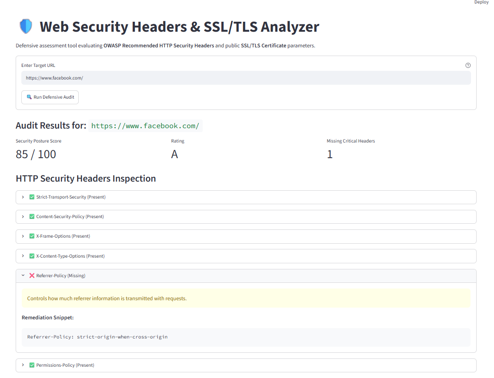
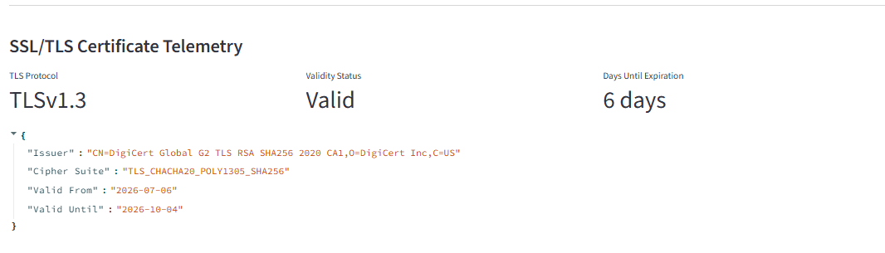

# Web Security Headers & SSL/TLS Telemetry Analyzer

Defensive assessment engine built to inspect **OWASP Recommended HTTP Security Headers** and audit public **SSL/TLS Certificate** parameters in real time.

[](https://www.python.org/)
[](https://streamlit.io/)
[](https://owasp.org/)

> 🚀 **Live Demo:** Access the interactive cloud app at [Deploy Link Pending]

---

## 🛡️ Core Capabilities

- **Defensive HTTP Header Auditing:** Evaluates implementation against OWASP hardening standards:
  - `Strict-Transport-Security` (HSTS)
  - `Content-Security-Policy` (CSP)
  - `X-Frame-Options` (Clickjacking defense)
  - `X-Content-Type-Options` (MIME sniffing prevention)
  - `Referrer-Policy` (Leakage protection)
  - `Permissions-Policy` (Browser feature isolation)
- **Security Posture Scoring:** Weighted algorithm yielding an overall posture score and letter grade (A to F), paired with ready-to-use Nginx remediation snippets.
- **SSL/TLS Telemetry Extraction:** Socket-level cryptographic inspection retrieving TLS protocol versions, cipher suites, issuing authorities, and certificate validity windows.

---

## 📸 Telemetry & Inspection Artifacts

### 1. HTTP Security Headers & Posture Score


### 2. SSL/TLS Certificate Analysis


---

## ⚙️ Local Setup & Execution

To run this tool locally for development or auditing purposes, execute the following commands in your terminal:

```bash
# 1. Clone the repository
git clone [https://github.com/IanYosho/07_web-security-headers-analyzer.git](https://github.com/IanYosho/07_web-security-headers-analyzer.git)
cd 07_web-security-headers-analyzer

# 2. Configure virtual environment
python -m venv venv
.\venv\Scripts\activate

# 3. Install dependencies and run the application
pip install -r requirements.txt
streamlit run app.py

🛠️ Tech Stack
Framework: Streamlit

Language: Python 3

Libraries: requests, cryptography

Core Protocols: HTTP/HTTPS, SSL/TLS Handshake